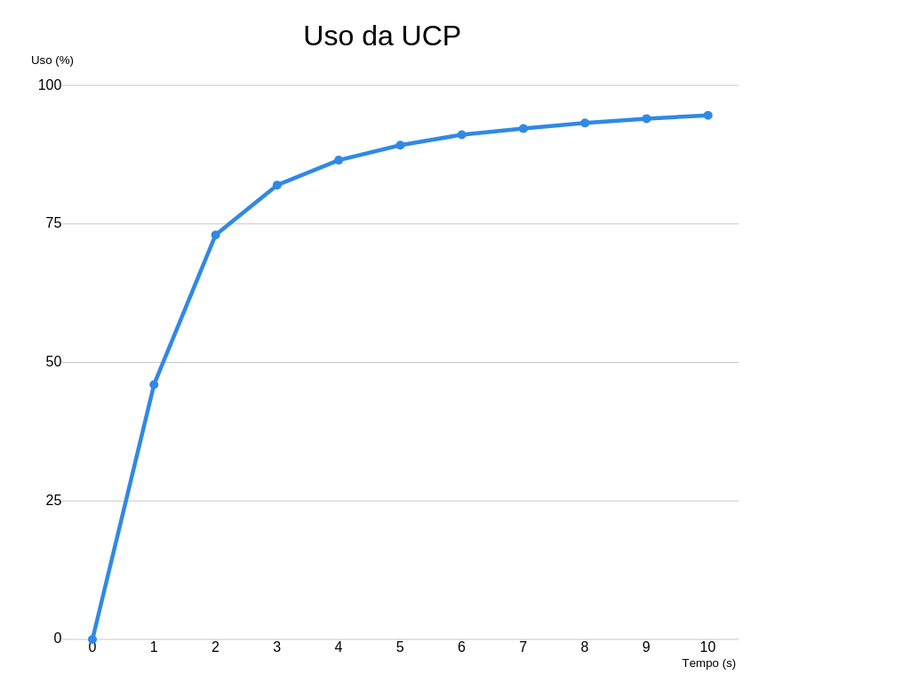
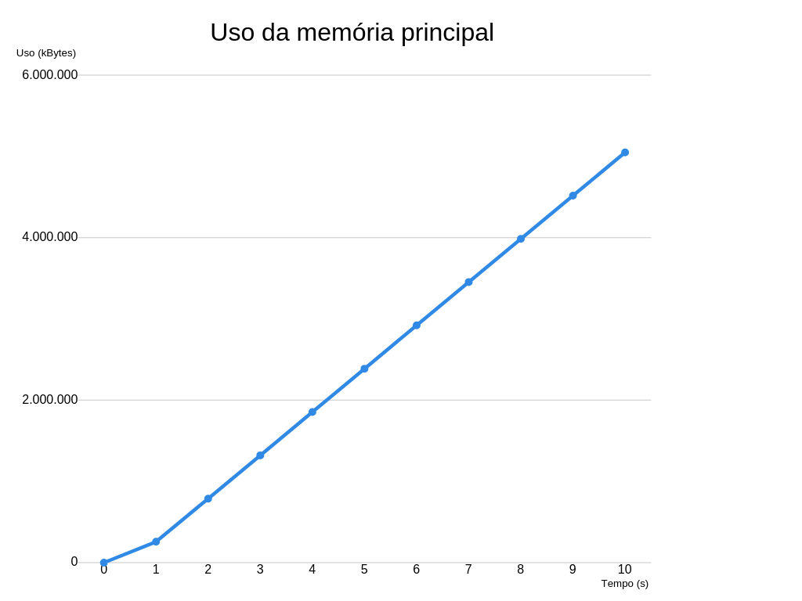

# Identificação

 - Página do repositório do trabalho ([link GitHub](https://github.com/gabriel-fc/teaching/tree/master))

 - Discente 1
	
	- Nome: Gabriel Ferreira Cerqueira
	- Matrícula: 16110640
	- Distribuição da nota(%): 100

# Resultados 

- **UCP** :




- **UCP-MEM**:



# Discussão

### Utilização intensa da UCP
	
	

   ``` "ps u child %d | awk '{print $3}' | grep -v %CPU ", pid```


**O comando ps** nos sistemas unix é responsável por obter certas informações estáticas dos processos em execução no S.O. No caso acima, são obtidas diversas snapshots dos dados do consumo de UCP pelo apartir do PID (identificador de processo) determinado pela variável pid.

**Obs**.: É válido ressaltar que há a possibilidade do consumo passar dos 100%, isso occorre pois o comando ps avalia o cosumo em um núcleo de processamento e caso o processo necessite de mais recursos, o sistema pode recorrer a outros núcleos.


Utilizando o comando acima, recuperamos os dados do consumo de UCP do processo filho. Os resultados foram próximos ao esperado, tendo a primeira amostra, quando t = 0 (seja t o tempo de execução do processo filho), também igual a zero, uma vez que o trecho de código responsável pelo alto consumo de processamento ainda não tinha sido executado.

Ao longo dos próximos 10 segundos, foi possível constatar a proximidade do consumo aos 100%, uma vez que o código utilizado para tal, um loop infinito, **monopoliza a UCP** e **congestiona a fila de processos** do sistema. Foi possível observar na pratica que, mesmo com o alto consumo de UCP, o S.O manteve-se funcionando mesmo que com gargalos e isso se deve ao fato dos vários núcleos de processamento dos hardwares atuais e, principalmente,  ao sistema de **tempo compartilhado**, responsável por gerir e definir um limite de tempo do uso da UCP, colocando em modo de espera programas que passem deste prazo.

O comportamento do gráfico, se assemelhando à uma função exponencial, é perfeitamente justificável dado a forma como um loop infinito interfere na lista de processos do S.O.


### Utilização intensa da  UCP e memória


        int i;
        for (i = 0;; i++) {
    		if(i%10 == 0){
            	malloc(sizeof(unsigned char));
            }
        }


A função acima foi utilizada para o teste de alocação da memória. Dentro do loop infinito (anteriormente foi dito que este algoritmo consome muito recurso da UCP) blocos de memória principal são alocados. É válido ressaltar **que a linguaguem c** permite o controle da memória por parte dos desenvolvedores, diferente de linguagens de mais alto nível, onde há gerenciadores de memória nativos.

Programas que alocam blocos de memórias descordenadamente, e sem o controle de seus identificadores, acabam por ter sérios problemas de **memory leak**, consumindo muito recurso do computador do usuário, evidenciado de forma clara através dos travamentos gerados ao executar o código acima. 

A função **malloc** (definida em <stdlib.h>) tem como parâmetro o tamanho do bloco de memória a ser alocado, retornando o identificador do bloco, dessa forma foram alocados durante 10 segundos vários blocos de tamanho 1 byte, tamanho mínimo definido através da função **sizeof** (<stdio.h>).

 ```"ps u %d | awk '{print $5}' | grep -v VSZ", pid```

A ideia do algoritmo é executar um trecho de código, feito pelo processo pai, responsável por recuperar dados do processo filho através do seu PID e do comando acima, e em outro trecho executar tarefas que exijam muitos recursos do computador. Durante o processo de alocação de memória esbarrei com problemas de limite de RAM pelo alto número requisições de alocação, mesmo que feito em blocos de 1 byte não havia memoria principal suficiente para a demanda do programa. Dito isso, foi necessário utilizar de um condicional que limitasse o número de requisições de recurso e o ```if(i%10 == 0)``` foi responsável por isso, diminuindo o número de bytes alocados em dez vezes. 

Sobre o gráfico, a função malloc é executada de forma bem eficiente, e isso se deve ao fato de a linguagem c não ser tão alta abstração e, não bastasse isso, o fato de os sistemas operacionais serem majoritariamente desenvolvidos em c contribui para sua performance. Dito isso, é bastante plausível a forma como o gráfico se comporta, sendo linear durante o processo, desde que haja mémoria principal disponível e capacidade de processamento suficiente. 


	 	
  


