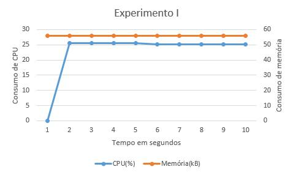
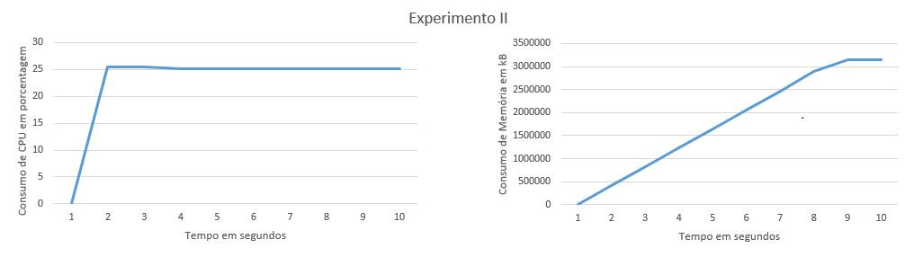
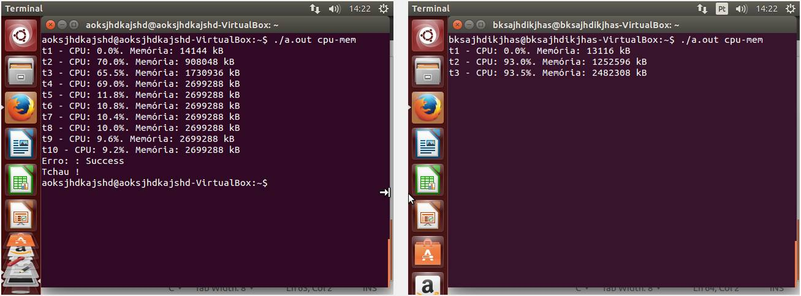

# Identificação

* Página do repositório do trabalho ([link GitHub](https://github.com/Leandro97/teaching)) 

* Discente 1
	* Nome: Leandro Martins de Freitas
	* Matrícula: 15111982 
* Discente 2
	* Nome: Douglas Henrique Maximo da Silva
	* Matrícula: 15111881

# Discussão 

* TODO: Em cada seção:
	* explicar e discutir sobre o comportamento do programa para cada experimento;
	* sempre referenciar o código fonte e o gráfico do experimento realizado;
	* colocar um gráfico do consumo da UCPe da memória pelo processo filho em função do tempo sendo duas curvas;
		* cada curva representa uma métrica medida (consumo de UCPem porcentagem e consumo de memória em Kilobytes);
		* o eixo das abscissas deve representar o tempo medido a cada segundo e o eixo das coordenadas deve ser a métrica medida.

##Utilização intensa da UCP

No experimento em questão, foi notado que na marca de 1 segundo, a utilização de CPU é de 0.0%, isso se dá pelo fato de que, quando o algoritmo é executado pelo usuário o seu processo é mandado, inicialmente, para a fila de espera para apenas em seguida ir para a execução no processador. 

A partir do tempo 2 até o tempo 10, o experimento tem como saída, em média, 25.3% de uso de CPU, para um computador com 4 núcleos - como o utilizado no experimento -, isso evidencia que, durante o tempo de execução, numa máquina com apenas um núcleo, este se dedicaria inteiramente à execução do processo.

Nota-se também que a quantidade de memória mantem-se constante, pois apenas a quantidade de memória suficiente à execução do programa foi alocada. Vide figura Gráfico do Experimento I.

## Utilização intensa da UCPe memória
	

No experimento II, quanto ao uso de Unidade central de processamento, é idêntico ao Experimento I, tendo no tempo 1, 0.0% de uso e a partir do tempo 2 até o tempo 10, mantem-se em média com 25.3% de uso. Já em relação ao uso de memória, nota-se que, diferentemente do Experimento I, o experimento II, aloca memória em cada tempo, tendo um grande crescimento a partir do tempo 1 até o tempo 8, e do tempo 8 ao 10, o crescimento no uso de memória diminui e tende a se estabilizar, vide figura Gráfico do Experimento II. 

A explicação para tal fato é que o alocamento de memória está se aproximando do máximo da capacidade da máquina, em um sistema 32-bits, o sistema operacional bloqueia a quantidade máxima de memória a ser utilizada por aquele processo, por isso o crescimento do alocamento de memória tende a zerar.

Quando executado em máquinas diferentes da utilizada para elaboração do relatório, o algoritmo executado para análise de CPU e memória, causou travamento ao se aproximar da capacidade total de memória das máquinas. Há, porém, uma particularidade: na máquina usada para a realização dos experimentos, não há área de swap. Fizemos uso de 2 máquinas virtuais com Ubuntu 14.04 versão 64 bits - uma com área de swap e outra sem - para simular os experimentos de alocação de memória. Ao atingir o limite máximo de alocação de memória o computador sem swap não apresenta travamentos e a quantidade de memória usada mantém-se constante depois de um certo tempo.

Os programas foram executados “ao mesmo tempo”.

Visto que a comunicação entre o processador e o disco rígido é muito mais lenta que a troca de mensagens entre CPU e memória principal, ao utilizar o swap

